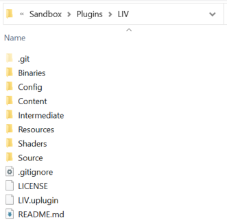
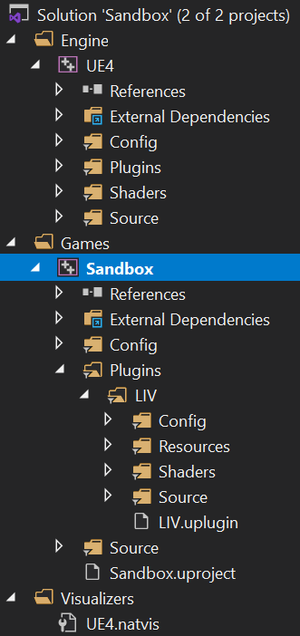
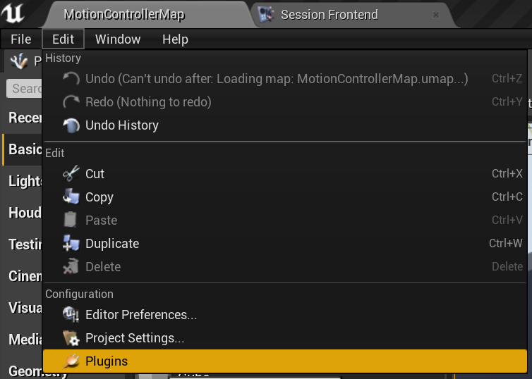
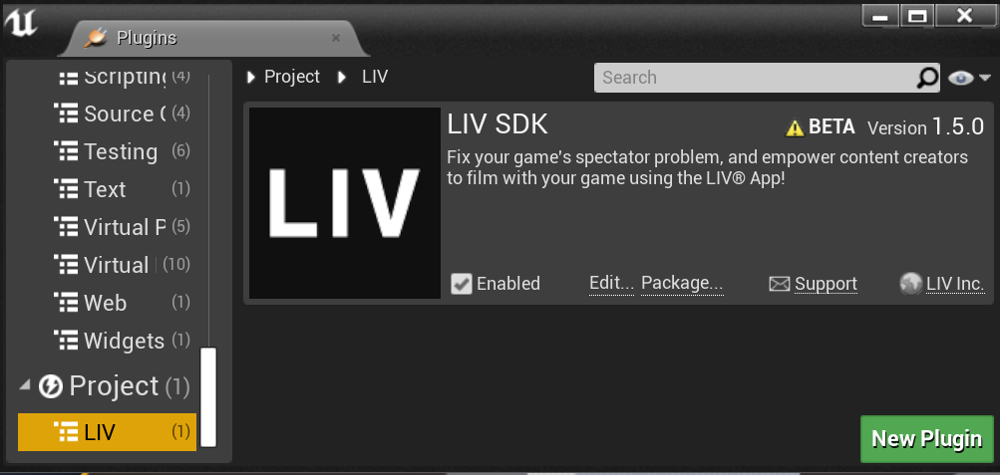
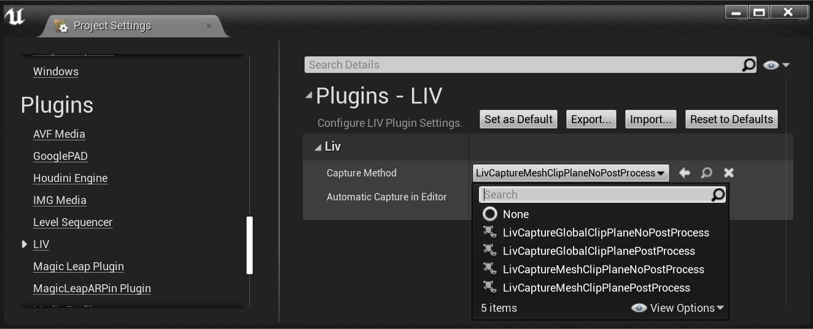
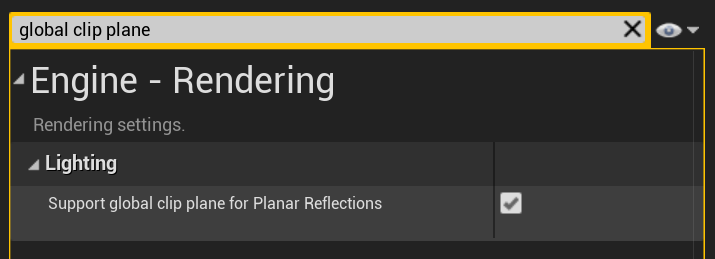
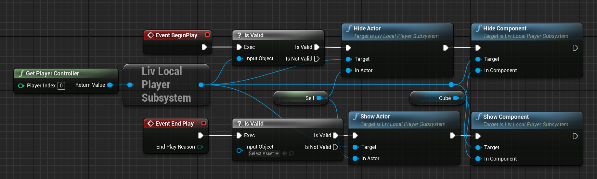

# LIV SDK v1.5 for Unreal

## Plugin Installation

1. If not already present, create a directory called `Plugins` in your Unreal project's directory.  

2. Copy this directory into the Plugins directory, it should be named 'LIV'.  

3. Generate project files for your project (right click your [Project-Name].uproject file > Generate Visual Studio project files)  

4. Open the Visual Studio solution ([Project-Name].uproject) and make sure you can see the LIV plugin in the solution explorer.  

5. Build and run your project to launch the editor. You can just press F5 or click the button in the screenshot below.  

6. You can check the LIV plugin is installed correctly by navigating to Edit > Plugins.  

7. Check you see the LIV plugin which will typically be at the bottom of the lefthand list under `Project`.  


## Integrating LIV

### Quick Integration

Just by installing the plugin your game is able to be captured by LIV, for more advanced customisation see "Advanced Integration".

### Advanced Integration

The LIV plugin provides a variety of rendering methods for capturing your gameplay. To change the method used you can select a different class for "Capture Method" in the LIV Plugin Settings. You can access this from Edit > Project Settings, in the LIV section under the Plugins header.



The default capture method is `ULivCaptureMeshClipPlaneNoPostProcess` as it is one of the cheaper capture methods and will work without requiring you to enable the global clip plane.

If you want transparent objects in the foreground to render over the top of the player / avatar then then you must use a global clip plane based capture method.

Below we will outline some details of the capture methods LIV provides.

#### ULivCaptureGlobalClipPlaneNoPostProcess

This method captures your gameplay twice each frame for the foreground and the background. It requires support for the global clip plane in `Project Settings`. The captured images do not have post processing and this method requires 3 render targets.

#### ULivCaptureGlobalClipPlanePostProcess

This method requires capturing your gameplay three times each frame to provide post processed images with the correct masks to LIV. This method also requires support for the global clip plane. We require 4 render targets for this method.

#### ULivCaptureMeshClipPlaneNoPostProcess

This method uses a mesh instead of the global clip plane to separate foreground and background and requires capturing twice each frame. 4 render targets are used in this method and the images will not using post processing.

#### ULivCaptureMeshClipPlanePostProcess

This method also uses a mesh instead of the global clip plane and does support post processing but requires 3 captures each frame. Overally we also require 5 render targets for this method.

### Global Clip Plane

Some of LIV's capture method require the Global Clip Plane to be enabled. Unless you are already utilising the Global Clip Plane then it is best to use the methods that do not require it as there is a [performance impact](https://docs.unrealengine.com/en-US/BuildingWorlds/LightingAndShadows/PlanarReflections/index.html) from enabling it.

If you wish to enable support for the global clip plane it can be found in `Project Settings` and requires restarting the editor.  



### Show and Hide Actors and Components

By getting a reference to the Liv Local Player Subsystem via a Player Controller you can show and hide actors and components. A typical place to put the calls would be within the Begin Play and End Play events of your pawn. Make sure to check the validity of the subsystem!



## Testing

**Note**: These instructions are the minimum you need to check if your integration worked.

**We suggest testing with a packaged build of your application!**

- Download the [LIV App]( https://liv.tv/download#liv-app ).
- Run it, install the Virtual Camera driver.
- In LIV, launch the compositor.
- Run your project.
- Using "Manual" capture mode, pick your project from the list.

If all has gone well, you'll see your application in LIV's output! 

## Known Issues

We are aware of a performance bug ([UE-86191](https://issues.unrealengine.com/issue/UE-86191)) affecting UE4.23 onwards, if this issue affects you or your customers we recomend voting on the issue.

Adding the following to your `DefaultEngine.ini` may help mitigate the performance issues:

```
[/Script/Engine.RendererSettings]
r.SceneRenderTargetResizeMethod=2
r.SceneRenderTargetResizeMethodForceOverride=True
```

## Further Help & Feedback

We want to hear your ideas, plans, and what you're going to end up doing with the SDK - if you've got an exotic idea that you might need a hand with - reach out. We're just as enthusiastic as you <3

We're always available through our , so please pop in if you need help. If you're not familiar with Discord, it's a popular gaming-oriented instant messenger & VOIP client.

Alternately, you can email us through techteam@liv.tv!

### Support Links

* [Developer Portal](https://dev.liv.tv/)
* [User Support](https://help.liv.tv/hc)
* [Discord Community](http://liv.chat)
* [Contact Form](https://help.liv.tv/hc/requests/new)
